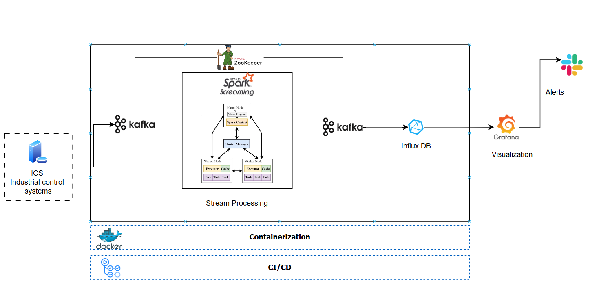

# Real-Time-Anomaly-Detection

**Data Simulation and Ingestion**
- **Technology**: Apache Kafka
- **Description**: Kafka will simulate the ingestion of real-time data streams from sensors in an industrial environment.
It will publish data from a pre-collected dataset (SWaT) mimicking a Supervisory Control and Data Acquisition (SCADA) system.


**Preprocessing & Feature Engineering**
- **Technologies**: Python libraries (Pandas, NumPy)
- **Description**: Preprocess the incoming data by cleaning it (handling missing values), normalizing sensor readings, and performing feature extraction to prepare it for training anomaly detection models. 
This step is crucial to ensure high-quality input for the learning algorithms.

**Anomaly Detection Models**

- **Technologies**: Autoencoders, Clustering algorithms (k-Means, DBSCAN)
- **Description**: Train an autoencoder to learn the normal operational patterns from historical data. 
The reconstruction error of the autoencoder will be combined with clustering algorithms to classify detected anomalies into categories such as sensor drift, equipment malfunction,
and cybersecurity threats.

**Stream Processing**
- **Technologies**: Spark Streaming
- **Description**: Implement a stream processing pipeline that continuously monitors the incoming data streams for anomalies. 
The hybrid anomaly detection model will process the data in real-time, ensuring immediate detection of deviations from expected operational patterns.

**Visualization & Alerts**
- **Technologies**: Grafana, Slack
- **Description**: Use Grafana for real-time visualization of the sensor data and anomalies. 
Alerts will be configured to notify operators via Slack, SMS, 
or email when significant deviations are detected, ensuring prompt response to potential issues.

**Deployment**
- **Technologies**: Docker
- **Description**: The entire system will be containerized using Docker to facilitate easy deployment on local machines or edge devices. 
This approach enables distributed simulation and processing of the ICS environment.

### Tools & Technologies

- Containerization - [**Docker**](https://www.docker.com), [**Docker Compose**](https://docs.docker.com/compose/)
- Stream Processing - [**Kafka**](https://kafka.apache.org), [**Spark Streaming**](https://spark.apache.org/docs/latest/streaming-programming-guide.html)
- Orchestration - [**Airflow**](https://airflow.apache.org)
- Machine Learning - [**PyTorch**](https://pytorch.org/)
- Data Visualization - [**Grafana**](https://grafana.com/)
- Language - [**Python**](https://www.python.org)

## Architecture




## Setup

#### Docker
```
docker compose up -d --build
```